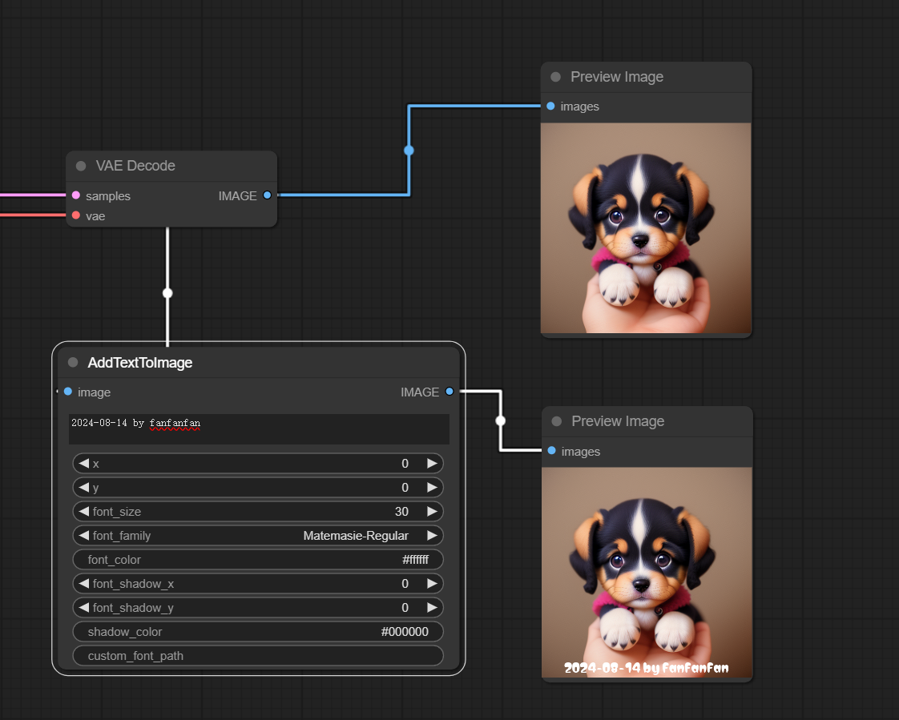
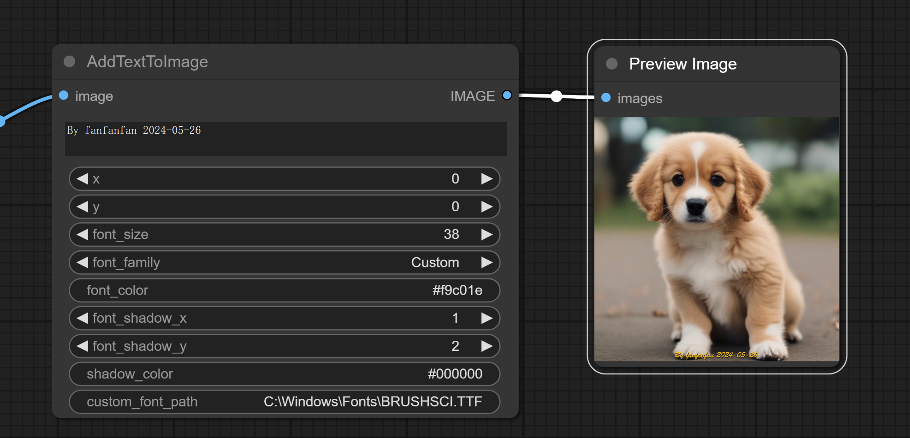

# How to Use
- Node location：Add Node / AI_Boy / AddTextToImage

# Font
in，_fonts_ Folders（If you need to specify a custom font, place the font file in the _fonts_ directory of the current node）The local font file is stored in the `custom_font_path` node, which is the font style of the text display. The font file is not required. The font path can be directly specified in the node's `custom_font_path`. The supported font format suffixes are `.ttf/.TTF/.ttc/.TTC`
# Node properties
| property               | describe                                                   | must                                                                                                                                                       |
|------------------|------------------------------------------------------|----------------------------------------------------------------------------------------------------------------------------------------------------------|
| image            | The node's input type must be image                                      | 是                                                                                                                                                        |
| IMAGE            | The output type of the node is IMAGE                                        | 是                                                                                                                                                        |
| x                | The text is displayed at the y-axis coordinate of the image                                       | No. By default it is located directly below the image                                                                                                                                          |
| y                | The text is displayed at the y-axis coordinate of the image                                       | No. By default it is located directly below the image                                                                                                                                              |
| font_size        | Font size                                                 | yes                                                                                                                                                        |
| font_family      | Font Style                                                 | Yes.   If there are fonts in the fonts folder, you can select the fonts in the fonts folder (comfyui/custom_nodes/fonts). When the value of this property is "Custom", you need to specify the value of the "custom_font_path" property                                                           |
| custom_font_path | Font path, such as specifying the font path that comes with Windows "C:\Windows\Fonts\SIMLI.TTF"| No.   When "font_family"="Custom", you need to specify a value for the "custom_font_path" attribute                                                                                          |
| font_color       | Font color, supports RGB format (255,255,255) and hexadecimal format(#000000)            | Yes. Default is "#ffffff", which is white.                                                                                                                                      |
| font_shadow_x    | Font shadow x-axis offset                                            | No. Default is 0                                                                                                                                                  |
| font_shadow_y    | Font shadow x-axis offset                                            | No. Default is 0                                                                                                                                                |
| shadow_color     | Font shadow color                                               | No.   When the attribute "font_shadow_x"=0 and the attribute "font_shadow_y"=0, this attribute is not effective.   When one of the attributes "font_shadow_x" and "font_shadow_y" is not 0, this attribute is effective and the value of this attribute needs to be specified. The default value is "#000000", which is black. |

# Install
Clone the repository into the custom_nodes directory of ComfyUI, and then restart ComfyUI.
